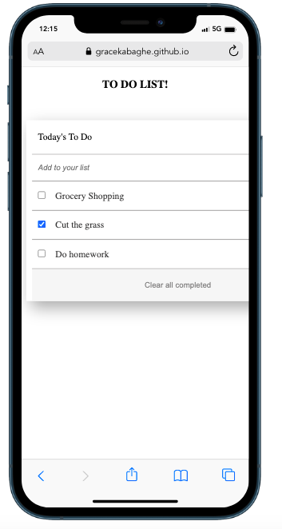

# TO-DO List

> Items can be added to the list by entering the item in question in the "Add to your list" tab. 
>  To delete an item click on the bin icon.
>  When an item is completed, click the checkbox and it will be striked through.
>  Items can also be edited by clicking on the item in question and changing the text as needed.

Additional description about the project and its features.

## Built With

- Javascript
- CSS3
- HTML 5
- Webpack

## Live Demo

[Live Demo Link](https://gracekabaghe.github.io/to-do/)

## To Set Up Locally

-  copy git@github.com:gracekabaghe/to-do.git
- Go to the commandline and enter git clone and paste in the copied URL
- CD into the project

## Author

👤 **Grace Kabaghe**

- GitHub: [@githubhandle](https://github.com/gracekabaghe)
- LinkedIn: [LinkedIn](https://linkedin.com/in/grace-kabaghe)

## 🤝 Contributing

Contributions, issues, and feature requests are welcome!

Feel free to check the [issues page](../../issues/).

## Show your support

Give a ⭐️ if you like this project!

## Acknowledgments

- Hat tip to anyone whose code was used

## 📝 License

This project is [MIT](./MIT.md) licensed.